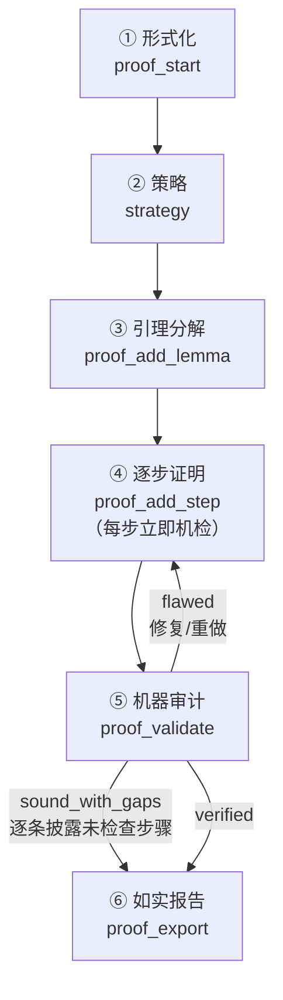

<div align="center">

# ∷ math-rigor ∷

**严格 · 可审计 · 数学证明工具链，装在 ZCode 上**

> `∀ ε > 0, ∃ δ > 0, s.t. |x − a| < δ ⟹ |f(x) − L| < ε`

一个本地 **MCP 服务器（23 个工具）** + 一个**流程 skill** + 两个 slash 命令，
让数学论证的每一步都能被机器检查——并且**如实报告哪些部分被验证过，哪些没有**。

[](LICENSE)
[]()
[]()
[]()
[]()
[]()
[]()
[]()
[]()

</div>

---

## 为什么需要它

大模型数学推理最危险的一刻，是它把**「没找到反例」** 说成 **「成立」**，把**「超时」
** 说成 **「已验证」**。math-rigor 的全部设计围绕一件事：

> **判定词汇只有三种，且三者永不混淆：**
>
> | 判定 | 含义 | 能不能当结论用 |
> |---|---|---|
> | ✅ `proven` | 否定式被证明不可满足 | **能** |
> | ❌ `refuted` | 给出了具体反例 | 不能——命题是假的 |
> | ⚠️ `inconclusive` | 求解器没决定，且没找到反例 | **不能——这不是证明** |

证明审计在此基础上再加一档区分：

| 审计判定 | 含义 |
|---|---|
| 🟢 `verified` | 每一步都被机器检查，目标已导出 |
| 🟡 `sound_with_gaps` | 结构成立、无被推翻项，但有 N 步依赖人工论证 |
| 🔴 `flawed` | 有被推翻/无效的步骤、未解除假设、未证明引理，或目标未导出 |

🟡 这一档是**刻意存在**的：它让「有缺口的证明」无法被含糊成「已证明」。

---

## 六阶段工作流



**不可违背的规则**：每一步必须引用恰好一条规则与它用到的步骤 id；
禁止循环与前向引用；每条临时假设必须被解除；每个引理必须被证明或显式披露；
`inconclusive` 永远不等于证明。

---

## 特性

**推理规则做语法 + 语义双重检查**

22 条推理规则（`modus_ponens`、`reductio`、`universal_instantiation`…）每条先验形状，
再用 z3 验语义。`universal_generalization` / `existential_instantiation` 语义上并不自足，
工具会明确标注并改验新鲜性条件，而不是假装做了语义验证。

**代数步骤会被重新推导**

`algebra` 步骤不是记下来就算过——审计拿它引用的前提重新推导；推不出来判 `refuted` 并附反例。

**让 z3 真能证出数论命题**

SMT 对非线性整数 + 取模常返回 unknown。两处补强：

- **残数分情形** —— `∀n. P(n)` 拆成 `n = m·q + r`（`r` 取遍 `0..m−1`）逐个反证；
- **存在式改写** —— `∃k ∈ Z: A = c·k + d` 自动改写成 `c | (A − d)`。

于是 `6 | n³−n`、`30 | n⁵−n`、乃至自然写法 `n³−n = 6k` 都能证出。

**定义域从不偷偷决定**

未声明的符号做类型推断（含取模 ⇒ 整数；含小数 ⇒ 实数；否则实数），
结果永远出现在返回的 `sorts_used` 里。

**诚实的不判定**

`log(exp(x)) = x`、`2^n > n` 这类命题返回 `inconclusive` 并说明原因，
而不是给一个看起来像证明的输出。

---

## 快速开始

需要 Python 3.10+（无需 Node，无需 git）。

```powershell
# Windows
git clone https://github.com/bauerelizabeth07139/math-rigor.git
cd math-rigor
powershell -ExecutionPolicy Bypass -File .\install.ps1
```

```bash
# macOS / Linux
git clone https://github.com/bauerelizabeth07139/math-rigor.git
cd math-rigor
./install.sh
```

安装脚本会：建虚拟环境 → 装依赖（sympy、z3，约 60 MB）→ **先证明服务器能起来**
→ 注册 MCP → 装 skill 与命令。任一步失败都不会改动你的配置。

装完**新开一个 ZCode 会话**，然后：

```
/prove 对每个整数 n，n^3 - n 能被 6 整除
/audit-proof <粘贴一段别人的证明>
```

也可以直接提问——skill 会在涉及证明的任务上自动加载。

---

## 效果演示

```text
$ /prove 对任意正实数 x，x + 1/x >= 2

① 形式化    goal = "forall x in R: x > 0 -> x + 1/x >= 2", variables = {"x": "real"}
② 策略      直接证明（单个不等式，SMT 一次判定）
④ 逐步证明  verify_inequality(lhs="x + 1/x", relation=">=", rhs="2",
                   variables={"x": "real"}, constraints=["x > 0"])
            → status: proven   method: refuted the negated goal with z3
            proof_add_step(statement="x + 1/x >= 2", rule="machine_verified", ...)
            → verdict: verified
⑤ 审计      proof_validate → verdict: verified, machine_coverage 1/1 (100%)
⑥ 报告      "已机器验证：z3 反证否定式不可满足。无未检查步骤。"
```

```text
$ find_counterexample(claim="forall n in R: n^2 >= n")
→ verdict: refuted   counterexample: {"n": "1/2"}
```

```text
$ proof_add_step(statement="(a+b)^2 = a^2 + b^2", rule="algebra", from_ids=["g1"])
→ verdict: refuted
  detail: this algebra step does not follow from the cited premises;
          counterexample: {'a': '-1', 'b': '-1'}
```

审计抓错步骤时的输出就是这样——带反例，不和你商量。

---

## 工具总表

### 🧩 证明会话（工作流骨架）

| 工具 | 用途 |
|---|---|
| `proof_start` | 开一个证明会话：登记问题、精确目标、每个符号的定义域 |
| `proof_add_given` | 登记题面给定的前提 |
| `proof_add_assumption` | 登记临时假设（必须被解除） |
| `proof_add_lemma` | 登记引理义务 |
| `proof_add_step` | 加一步，**立即机检**并返回 verdict |
| `proof_validate` | 审计整个证明，给出三级判定与缺口清单 |
| `proof_status` | 查看会话（空参则列出全部） |
| `proof_export` | 导出 Markdown / LaTeX / JSON |
| `proof_workflow` | 返回六阶段流程与判定词汇表 |

### 🧠 逻辑

| 工具 | 用途 |
|---|---|
| `logic_check_step` | 单步推理是否合规（形状 + 语义） |
| `logic_entails` | 前提能否推出结论 |
| `logic_truth_table` | 纯命题逻辑完全枚举 |
| `logic_rules` | 22 条规则 + 19 种非逻辑理由的目录 |

### 🧮 数学

| 工具 | 用途 |
|---|---|
| `verify_identity` | 两个表达式是否同一个函数 |
| `verify_inequality` | 不等式在整个定义域是否成立 |
| `verify_forall` | 任何带量词的命题（整除、奇偶、界、逻辑） |
| `verify_induction` | 归纳法：基例 + `k ≥ start & P(k) → P(k+1)` |
| `verify_limit` | 极限值（支持单侧与无穷） |
| `find_counterexample` | 找反例（先问 SMT，再穷举，再采样） |
| `symbolic_eval` | 化简/展开/因式分解/求导/积分/求和闭形式/解方程/级数/极限 |
| `symbolic_numeric` | 高精度数值 + 是否精确有理数 |
| `number_theory` | 整除、素数、gcd、贝祖系数、CRT、原根、勒让德符号等 |
| `expr_normalise` | 规范化成 LaTeX / 纯文本 / sympy 形式 |

---

<details>
<summary><b>📐 记法约定</b>（容易踩的坑，点开看）</summary>

- **单个 `|` 按数学惯例消解**：两侧是命题（大写字母开头，`P | Q`）当析取；
  两侧是数（`6 | n`、`n | m`）当整除。拿不准就用 `||` 表析取、`divides(6,n)` 表整除。
- **`^` 是乘方**，不是异或也不是合取。合取用 `&`。
- **邻接即乘法**：`n(n+1)` 是乘积。要让 `f(x+1)` 当函数调用，把 `f` 放进 `functions`。
- **定义域声明放进 `variables`**（如 `{"n": "int"}`），写成语句会被明确报错并提示正确做法。
- `pi` / `e` 在符号层是数学常数；在 `variables` 里显式声明即可当普通变量用。
  SMT 层没有精确超越常数，遇到会明确报错而不是静默处理。

完整约定见 [`skills/math-rigor/references/notation.md`](skills/math-rigor/references/notation.md)。
</details>

<details>
<summary><b>🏗️ 架构</b></summary>

```
server/math_rigor_server.py   23 个 MCP 工具的注册与 JSON 包装
server/rigor/
  ast_nodes.py    公式解析器（纯数学 / LaTeX / sympy 三写法，含 `|` 消歧）
  translate.py    AST ↔ sympy ↔ z3 双向翻译，含类型推断
  smt.py          SMT 证明引擎：Skolem 化、残数分情形、存在式改写、模型读取
  logic.py        22 条推理规则的形状 + 语义检查，命题真值表
  symbolic.py     sympy 符号运算、恒等式验证、高精度数值
  verify.py       不等式 / 全称命题 / 归纳 / 极限 / 反例搜索 / 数论
  proof.py        证明会话、步骤 DAG、审计、Markdown/LaTeX 导出
skills/math-rigor/            流程 skill 与 4 份参考文件
commands/                     /prove 与 /audit-proof
tests/                        8 个测试模块（含真实 MCP stdio 端到端）
tools/                        安装、冒烟测试、安装自检、文档生成
```

`skills/math-rigor/references/` 中的 `inference-rules.md` 与 `worked-examples.md`
是**从代码与真实工具返回生成**的——改了工具行为就重新生成，文档永不与实现脱节。
</details>

<details>
<summary><b>🧪 测试</b></summary>

```bash
venv/bin/python tests/run_all.py          # 8 个模块，约 275 条断言
venv/bin/python tools/smoke_test.py       # 服务器能否起来并证出一个已知真命题
venv/bin/python tools/install_check.py    # 按 ZCode 的加载规则校验 skill / 命令 / 配置
```

CI（`.github/workflows/tests.yml`）在 **3 个系统 × 2 个 Python 版本** 上跑冒烟测试 +
完整测试套件。当前 `main` 全绿。
</details>

---

## 已知边界

- SMT 无法判定的命题（符号幂、超越函数、部分高阶非线性）返回 `inconclusive`。
  对策是拆成可判定的引理，其余作为 `unchecked` 显式披露。
- `verify_induction` 的归纳步若需要更强的归纳假设，会返回 `refuted` 并给出破坏它的 k。
- 残数分情形子问题数上限 512，模数超过 64 的不参与自动分情形。
- 全称量化的整数命题若是三次以上且含取模，单次判定可能需要数十秒。

---

<div align="center">

**∷ math-rigor ∷**

*「证明不是说服，而是可检查的结构。」*

[MIT License](LICENSE) · by [bauerelizabeth07139](https://github.com/bauerelizabeth07139)

</div>
